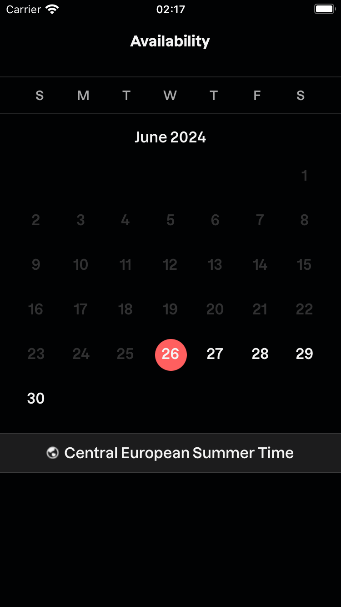
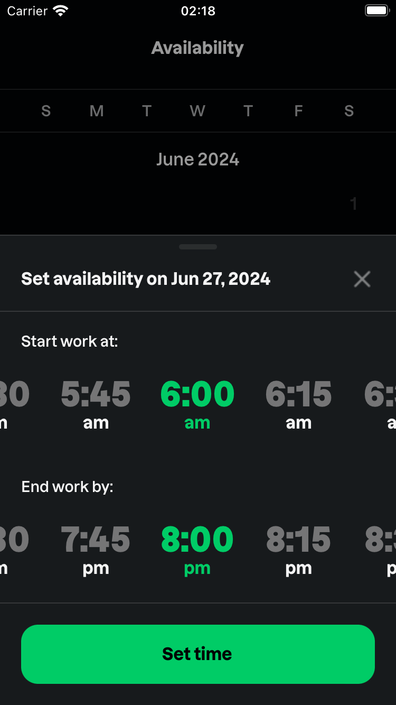
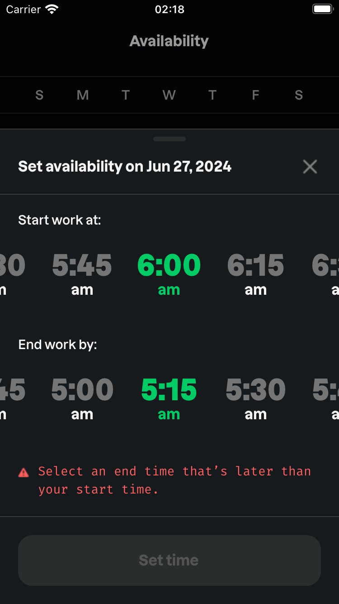
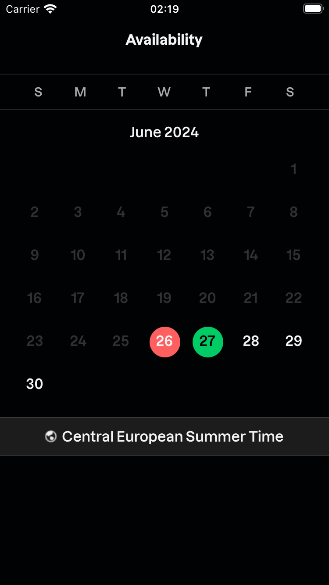

# React Native Truckup Shift Selector Challenge

This is a React Native Calendar application with features such as a time picker, highlighted today's date, historical days in muted color, timezone display, and more.

## Features

- Highlight today's date in red
- Display historical days with muted text color
- Show device timezone
- Display current month, future months scrollable vertically
- Snap entire month into view
- Time picker with 15-minute intervals in AM/PM format
- Haptic feedback on time selection
- Bottom sheet for setting availability

## Screenshots






## Screen Recording

Watch the screen recording [here](./assets/demo/demoVideo.mov).

## Installation

To run this project, follow these steps:

1. Clone the repository:

```bash
git clone https://github.com/FatjonRrapaj/TruckupChallenge.git
cd your-repo
```

2. Install dependencies

```
yarn install
```

3. Run the Application

for iOS

```
yarn ios
```

for Android

```
yearn android
```

### Note

The Swipe down to close Bottom Swipe Modal works only if swiped on the Bottom Swipe Header.
Sorry for that, I am really pressed for time, did not use RN bottom sheet or anything, just the Plain React Native Modal
